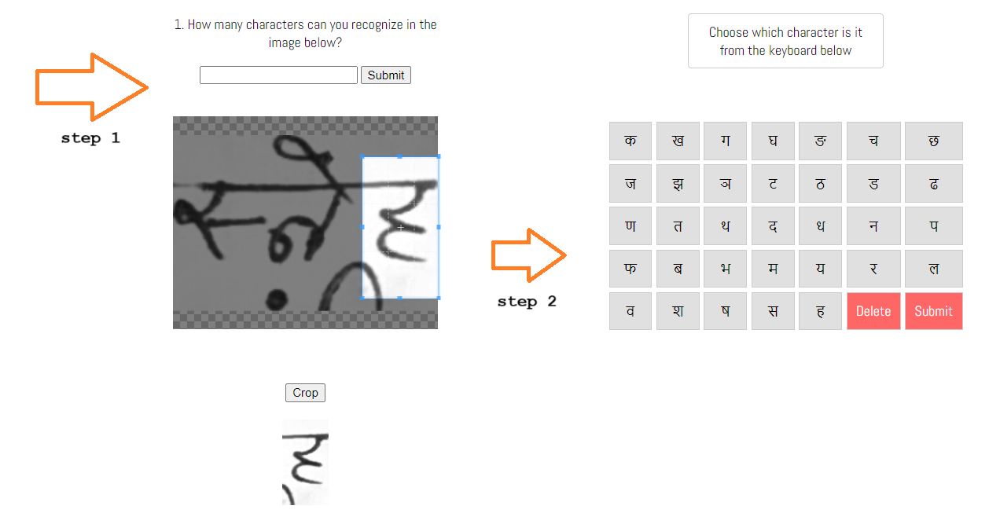

# 
 DCDA 

 Devanagari Character Dataset Automation 

## What?  
This project is made for automating the process (to an extent) of making curated handwritten datasets for any language. The project focuses on Devanagari but it can be used universally with all the languages compatible with the Tesseract OCR engine.
  
This project is like a self improvization closed loop for the existing OCR technology for Devanagari, by inducing minimal human intervention in the tedious process of dataset creation.

## Why? 
This idea originated due to the absence of large datasets on the internet available for the devanagari script. Because it is the least explored domain in terms of OCR technology [Refer to [ this research paper](https://www.researchgate.net/publication/304406868_Deep_learning_based_large_scale_handwritten_Devanagari_character_recognition)]
### Major role of the existing research paper  
Before starting this project, I conducted thorough research on existing handwritten character datasets for the Devanagari script. And the biggest Dataset I found was the **Devanagari Handwritten Character Dataset**. Upon reading the paper thoroughly and contacting the authors, I was given very valuable suggestions from Professor Prashnna, who was the one of the authors of the currently largest available dataset which contains 92,000 images.
The paper was published in 2015, and that time, the authors collected the data and they had to manually process and crop out the individual characters from the recieved data.   

My project has eliminated all the physical human intervention and narrowed it down to a webpage, which tags and saves the characters.

## How?
The final project turned out to be drastically different than what it was planned like. This repository contains a pipeline of multiple programs which take input images of pages containing handwritten Hindi text, and perform the following processes in the order:  
1. Pre processing the input images (Grayscale and Binarization if needed)
2. Running word level OCR on them using parallel processing power of 7 workers together and exporting the bounding box data of all the words detected into a json file. (One image can contain thousands of words!)
3. A program which uses the exported json file, and the input images and crops out all the words mentioned in the json file.
4. The fourth step is the website where users can just visit and crop out characters one at a time using the embedded Cropper.js instance, and labelling them using the virtual keyboard and submitting them to the database. (Visualization of the website below)
  

The website has been finalized, and this will be the last part of the project, and after that, the data collection part will get initiated. [@simplycode](https://github.com/simplycode07/) is working on the backend part, and the website will be public and live after some thorough testing.

The ideation process of this project alone was months long and many versions were created and scraped, I would not cover those in this readme because it already is very long :'-)
# Outcomes, findings, problems and achievements gained during the process:
### What did I learn? 
* Pytesseract's introduction  
* React.js [New skill!]  
* Tesseract.js [New skill!]  
* Cropper.js [New skill!]  
* Introduction to existing OCR technologies and softwares like gImageReader, EasyOCR etc. (Tried every existing technology to get desired results, but ended up making it from scratch)

* Legacy version of tessdata is very inaccurate  
  
* Using a single worker to recognize a sample batch of images took 4 minutes and 30 seconds, while using the same sample batch and using 7 workers parallely completed the task in 1 minutes and 10 seconds, which is nearly 75% increase in speed.
But also pointing out from the documentation that the individual recognition speed does not change with multiple workers, its just that the processes get executed parallelly.  
 
  
Also read [ai.md](https://github.com/Kishlay-notabot/dcda/blob/main/tesseractr/docs/ai.md)
## Issues faced  
[#874](https://github.com/naptha/tesseract.js/issues/874)
[#877](https://github.com/naptha/tesseract.js/issues/877) 
[#884](https://github.com/naptha/tesseract.js/issues/884)
##### React.js
[#6559](https://github.com/TanStack/query/issues/6559) 
#### Cropper.js
[#1138](https://github.com/fengyuanchen/cropperjs/issues/1138)

## Pull requests and active discussions:

[#1140](https://github.com/fengyuanchen/cropperjs/pull/1140) Added example for V2 of Cropper.js  
[#878](https://github.com/naptha/tesseract.js/pull/878) Added a pull request for adding complex examples of bbox data manipulation and output generation.

## Older additions to readme:
### Comparison of the confidence values between both versions:

#### Sample image:

#### Legacy Model

#### 4.0/4.1 Model
 

Average confidence of Legacy model is : 79.5  
Average confidence of 4.0/4.1 model is : 89.83 

# Credits: 
* [Subhrajyoti Dasgupta](https://github.com/subhrajyotidasgupta/DevanagariHTR)  
* Prashnna Kumar Gyawali [Stanford University]  
* [The mentioned research paper](https://www.researchgate.net/publication/304406868_Deep_learning_based_large_scale_handwritten_Devanagari_character_recognition)
* [@simplycode](https://github.com/simplycode07/)

